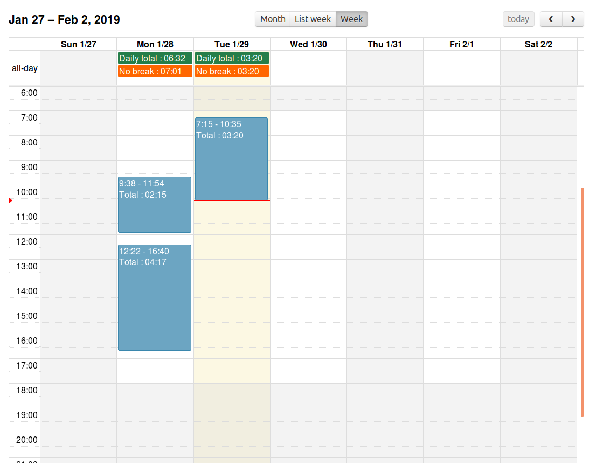

Automatic timesheet or presence planing via a bluetooth ping of your phone

# How it work?

every minute a small app run in your crontab to check if your phone is responding to ping, and store the result in a sqlite db.
The script need to have your bluetooth mac address.

here the crontab line to enter 
```
$ sudo crontab -e
```
```
* * * * * /home/pi/timesheet/venv/bin/python3 /home/pi/timesheet/spy_me.py -m xx:xx:xx:xx:xx
```

# How to access to the data ?
The database is quite indigest to use as human but a small web is doing the job.

If you launch the web app
```
$ /home/pi/timesheet/venv/bin/python3 app.py
```

then you have access to the web app with this [url](http://127.0.0.1:5000/)


# If it doesn't work as expected
* make sure the db file is created by and have data in it
* make sure you setup correctly your python environment (pip install)
* make sure you setup correctly your webapp dependencies (bower)

# Installation on a raspberry pi 3 (tested on raspbian)

```
sh -c "$(curl -fsSL https://raw.githubusercontent.com/pepitooo/timesheet/master/timesheet_on_raspbian.sh)"
```

using this method should be fully automated, but you HAVE to change the bluetooth MAC address inside `/etc/cront.d/timesheet`


